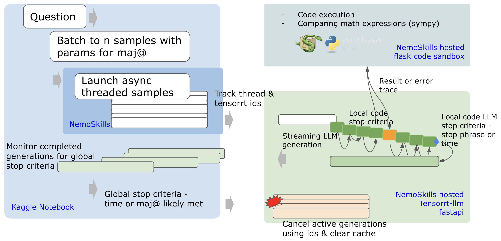
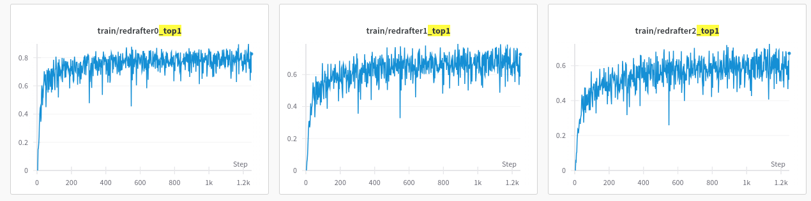

# Inference Engine

This section demonstrates how to create a [NeMo-Skills](https://nvidia.github.io/NeMo-Skills/) inference engine for answering unseen math problems. The engine can be hosted locally or in a Docker container. While we show a [TensorRT-LLM](https://github.com/NVIDIA/TensorRT-LLM) server example, similar setups work with [NeMo](https://github.com/NVIDIA/NeMo), [vLLM](https://github.com/vllm-project/vllm), or [sglang](https://github.com/sgl-project/sglang) servers.



## TensorRT-LLM Setup

We use TensorRT-LLM to convert pretrained models into TensorRT engines, leveraging inflight batching for improved throughput and latency.


### Installation

For TensorRT installation on linux, refer to the [installation guide](https://nvidia.github.io/TensorRT-LLM/installation/linux.html).

In this example we work off the `nvcr.io/nvidia/pytorch:25.01-py3` container. Where we install by running the below,
```
# See section `Install inside the PyTorch NGC Container`
[ -f /etc/pip/constraint.txt ] && : > /etc/pip/constraint.txt
pip uninstall -y tensorrt
pip3 install tensorrt_llm

# Check everything runs ok
python -c 'import tensorrt_llm'
```

We also install Nemo-Skills.
```
pip install git+https://github.com/alessiodevoto/NeMo-Skills.git@aimo-inference
python3 -c "import nemo_skills"
```

## Prepare weights

You can find the `OpenMathReasoning` collection [here](https://huggingface.co/collections/nvidia/openmathreasoning-68072c0154a5099573d2e730). We will use the `nvidia/OpenMath-Nemotron-14B-Kaggle` model with 14B parameters.

For this demonstration we will use FP8 quantisation, you can see the TensorRT-LLM Quantization Toolkit Installation Guide for more information. Note, FP8 quantisation is limited to GPUs which support `E4M3 FP8`, such as the Hopper family. For other GPUs, we recommend using `int8_wo` as mentioned in the Quantization Toolkit Guide. Calibration is not required for `int8_wo`.

!TODO: Mention not to import tensorrt in the main script because .... (check why this was)

### Download weights and dataset

On command line, generate a huggingface key to download the weights.
```
# Export your huggingface key to an environment variable
export HF_TOKEN=hf_Mt..

# Install the huggingface cli
pip install -U "huggingface_hub[cli]"

# Download the weights to a local directory
huggingface-cli download nvidia/OpenMath-Nemotron-14B-kaggle --local-dir OpenMath-Nemotron-14B-kaggle
huggingface-cli download nvidia/OpenMath-Nemotron-1.5B --local-dir OpenMath-Nemotron-1.5B


ns convert \
    --input_model=/mount/data/pkgs/aimo2/v07/Qwen2.5-1.5B-Instruct \
    --output_model=/mount/data/pkgs/aimo2/v07/qwen2.5-1.5b-instruct-trtllm \
    --convert_from=hf \
    --convert_to=trtllm \
    --num_gpus=1 \
    --model_type=qwen \
    --hf_model_name=Qwen/Qwen2.5-1.5B-Instruct
```

For calibration of the weights during quantisation we also need a dataset. We will use the dataset the models were trained on.
```
huggingface-cli download nvidia/OpenMathReasoning --repo-type dataset
```

#### FP8 Quantization

In a python script or Jupyter notebook, generate the calibrarion dataset.
```
import os
from datasets import load_dataset, Dataset
from itertools import islice
from nemo_skills.prompt.utils import get_prompt

LOCAL_DATASET_PATH = './calibrate_openmathreasoning'
prompt_template = get_prompt('generic/math', 'qwen-instruct')
calib_dataset = "nvidia/OpenMathReasoning"
calib_split = 'tir'
calib_size = 4096

# Load and take first N samples (no shuffling)
ds_samples = load_dataset(calib_dataset, split=calib_split, streaming=True)
ds_samples = list(islice(ds_samples, calib_size))

# Create dataset with formatted text
calib_ds = Dataset.from_dict({
    "text": [
        prompt_template.fill(
            {k: v for k, v in sample.items() if k in ['problem', 'generation']},
            continue_prefix_generation=True,
            prefix_generation_to_response=True
        )
        for sample in ds_samples
    ]
})

# Save
os.makedirs(LOCAL_DATASET_PATH, exist_ok=True)
calib_ds.to_parquet(f"{LOCAL_DATASET_PATH}/data.parquet")
```

Now that our dataset is saved, let start calibration and conversion to `TensorRT-LLM` engine format. There are two steps run here, quantisation of the weights and saving them to a `TensorRT-LLM` pytorch checkpoint, and building the checkpoint into an C++ engine. You can also run the individual steps by following the `examples/models/` folder in `TensorRT-LLM` repo and looking at the options for each architecture.

Now lets start quantisation and calibration. The detailed steps are listed in TensorRT-LLM for different architectures, but here we will use a help command from NeMo-Skills.
Setting `--num_gpus 1` uses no tensor parallelism. If you have more gpus, for example 4, set `--num_gpus 4` in the below, as well as `--tp_size 4` and `--server_gpus=1`.

```
ns convert --input_model  OpenMath-Nemotron-14B-kaggle \
           --output_model OpenMath-Nemotron-14B-kaggle-fp8-trtllm \
           --convert_from hf \
           --convert_to trtllm \
           --num_gpus 1 \
           --dtype fp8 \
           --hf_model_name nvidia/OpenMath-Nemotron-14B-kaggle \
           --model_type qwen \
           --max_input_len 30000 \
           --max_seq_len 32000 \
           --no-trt_reuse_tmp_engine \
           --calib_dataset calibrate_openmathreasoning
```
Now your engine is ready to be served.

## ReDrafter speculative decoding

[ReDrafter](https://machinelearning.apple.com/research/redrafter-nvidia-tensorrt-llm) uses an RNN draft model, and combines beam search with dynamic tree attention to speed up LLM token generation by up to 3.5 tokens per generation step for open source models, surpassing the performance of prior speculative decoding techniques.

### ReDrafter Training

To train ReDrafter for the `OpenMath-Nemotron-1.5B` model we run the below. Training is not dependant on `tensorrt_llm`. We train below on the same dataset the model was trained on. If this data is not available the redrafter could alternatively be trained on prompts and generations from your model. Feel free to test different parameters, however we found 20k samples or more was sufficent to train a good ReDrafter.

Below is a helper command which uses the `OpenMathReasoning` dataset. Export your `WANDB_API_KEY` if you have experiment tracking.
```
# Install the ReDrafter library, we are on a later version of python so can ignore that check.
pip install --no-binary=protobuf --ignore-requires-python \
        "git+https://github.com/apple/ml-recurrent-drafter.git#egg=recurrent-drafting[dev,train]"

# Train
ns run_cmd --log_dir ./logs/ \
torchrun --nproc_per_node=2 -m nemo_skills.training.train_redrafter \
    --llm_name_or_path 'OpenMath-Nemotron-14B-kaggle' \
    --dataset "nvidia/OpenMathReasoning" \
    --dataset_split "tir" \
    --bf16 True \
    --output_dir "redrafter_" \
    --num_train_epochs 1 \
    --per_device_train_batch_size 1 \
    --gradient_accumulation_steps 4 \
    --save_strategy "no" \
    --learning_rate 0.001 \
    --weight_decay 0. \
    --warmup_ratio 0.1 \
    --lr_scheduler_type "cosine" \
    --logging_steps 20 \
    --tf32 True \
    --model_max_length 2048 \
    --dataset_nrows 100000 \
    --drafter_predict_n_tokens 3 \
    --drafter_num_layers 2 \
    --rnn True \
    --phase train \
    --report_to wandb
```

You can add W&B logging by setting `--report_to wandb`. Intermittent logs should be reported to screen like below, ideally you will be reaching a `redrafter2_top1` score over `0.6`, which means in 60% of the steps the next three tokens are accepted from the draft model.

```
{'redrafter0_top1': 0.8328, 'redrafter0_top2': 0.9262, 'redrafter0_top3': 0.9545, 'redrafter0_top4': 0.9731, 'redrafter0_top5': 0.9785, 'redrafter0_loss': 0.5236, 'redrafter1_top1': 0.7697, 'redrafter1_top2': 0.8895, 'redrafter1_top3': 0.9301, 'redrafter1_top4': 0.9477, 'redrafter1_top5': 0.9589, 'redrafter1_loss': 0.7651, 'redrafter2_top1': 0.7123, 'redrafter2_top2': 0.8425, 'redrafter2_top3': 0.8953, 'redrafter2_top4': 0.93, 'redrafter2_top5': 0.9481, 'redrafter2_loss': 0.936, 'epoch': 1.0}
```

Below is an example of the acceptance rate during training. Note, as we only use one epoch we do not evaluate on a separate validation set.




### Building TensorRT-LLM engine for draft model

Clone `TensorRT-LLM` so we have the examples with conversion scripts.
```
git clone https://github.com/NVIDIA/TensorRT-LLM/
```
When `NeMo-Skills` quantises a model we get a pytorch quantised checkpoint which is used to build the engine. We shall use this checkpoint to build a engine with `ReDrafter`. From the quantisation above, your checkpoint should be named something like, `OpenMath-Nemotron-14B-kaggle-fp8-trtllm-tmp-ckpt`.

We create the ReDrafter model using our trained model. Ensure that the `dtype` of your drafter is the same as the converted base model.
```
export BASE_TRTLLM_CKPT=$(pwd)/OpenMath-Nemotron-14B-kaggle-fp8-trtllm-tmp-ckpt
export REDRAFTER_PYTORCH_CKPT=$(pwd)/redrafter__redrafter_OpenMath-Nemotron-14B-kaggle_n_3_lr_0.001_layers_2
export REDRAFTER_TRTLLM_CKPT=$(pwd)/OpenMath-Nemotron-14B-kaggle-fp8-draft-ckpt
cd ./TensorRT-LLM/examples/redrafter
python convert_checkpoint.py --base_model_checkpoint_dir $BASE_TRTLLM_CKPT \
                             --drafter_model_dir $REDRAFTER_PYTORCH_CKPT \
                             --output_dir $REDRAFTER_TRTLLM_CKPT \
                             --dtype bfloat16 \
                             --tp_size 1 \
                             --redrafter_num_beams 1 \
                             --redrafter_draft_len_per_beam 3
cd ../../../
```

Now we build the checkpoint. Here we need to use the `trtllm-build` command. As we pass token sequences form the model to the sandbox and back, even if the initial math question is short, we need a long input length allowed to accomodate the llm generation plus the executed code.

```
trtllm-build --checkpoint_dir $REDRAFTER_TRTLLM_CKPT \
    --output_dir OpenMath-Nemotron-14B-kaggle-fp8-redrafter-trtllm \
    --gemm_plugin fp8 \
     --use_paged_context_fmha=enable \
     --max_batch_size 32 \
     --max_seq_len 32000 \
     --max_input_len  32000 \
     --max_num_tokens 32000 \
     --speculative_decoding_mode explicit_draft_tokens \
     --max_beam_width 1 \
     --kv_cache_type paged
```

And finally we copy the tokenizer.
```
# Copy the tokenizer
cp OpenMath-Nemotron-14B-kaggle/*tok* OpenMath-Nemotron-14B-kaggle-fp8-redrafter-trtllm/
```


## 🏗️ Launching Servers (Work in Progress)

OpenMathReasoning is a tool-instruction reasoning model that combines an LLM with a code sandbox to answer questions. The system works as follows:

1. The LLM generates Python code wrapped in `<tool_call>` and `</tool_call>` tokens
2. The code is extracted and executed in the sandbox
3. The sandbox returns results or error traces
4. The output is fed back to the LLM for continued generation

An example below,
```bash
Therefore, b = k - 7 = 21 or 49. So, same result. Therefore, sum is 70.\n\nAlternatively, maybe I can write a small program to check for all bases b > 9, compute 9b + 7 and b + 7, check if the latter divides the former, and collect all such bases. Then sum them. Let\'s do that to verify.\n\nHere\'s a Python code to perform the check:\n\n<tool_call>\n# Initialize a list to store valid bases\nvalid_bases = []\n\n# Check bases from 10 upwards\nfor b in range(10, 10000):  # Arbitrary large upper limit\n    num1 = 9 * b + 7\n    num2 = b + 7\n    if num1 % num2 == 0:\n        valid_bases.append(b)\n        print(f"Found base: {b}")\n\n# Sum the valid bases\nsum_bases = sum(valid_bases)\nprint(f"Sum: {sum_bases}")\n\n# If sum is over 1000, take modulo 1000\nif sum_bases > 1000:\n    result = sum_bases % 1000\nelse:\n    result = sum_bases\n\nprint(f"Final Result: {result}")\n</tool_call>\n```output\nFound base: 21\nFound base: 49\nSum: 70\nFinal Result: 70\n```\nThe code confirms that the valid bases are 21 and 49, summing to 70.
```

### LLM server

NeMo-Skills provides a helper command with the ability to host as LLM server with the `--model` argument and a few extra arguments for the server config. A code execution server can also be hosted in parallel with the command `--with_sandbox`.

As our instance has two servers we will use mpirun to launch the server and allocate 0.92 of the GPU memory.
```
ns start_server --model=./OpenMath-Nemotron-14B-kaggle-fp8-trtllm/ \
                --server_gpus=1 --server_type trtllm-serve \
                --server_args "--kv_cache_free_gpu_memory_fraction=0.92 --max_batch_size 12" \
                --with_sandbox
```

### 🏗️ LLM generate

These are two utility functions to allow concurrent generation.
```
import time
from concurrent.futures import ThreadPoolExecutor
from typing import Generator, Union

from nemo_skills.inference.model.code_execution import CodeExecutionWrapper
from openai import Stream

def consume_stream(stream: Union[Stream, Generator], thread_id=None):
    """Process a single stream and return concatenated text with timing."""
    start_time = time.time()
    result = ""
    try:
        for chunk in stream:
            if chunk['generation'] is not None:
                result += chunk['generation']
    except Exception as e:
        # this is expected to happen when the stream is cancelled
        pass
    
    end_time = time.time()
    duration = end_time - start_time
    
    return {
        'result': result,
        'duration': duration,
        'thread_id': thread_id
    }

def stream_generate(
    code_exec_model: CodeExecutionWrapper,
    prompts: list[str | dict],
    code_begin: str | list[str],
    code_end: str | list[str],
    code_output_begin: str | list[str],
    code_output_end: str | list[str],
    code_output_format: str | list[str],
    tokens_to_generate: int | list[int] = 512,
    temperature: float | list[float] = 0.0,
    top_p: float | list[float] = 0.95,
    top_k: int | list[int] = 0,
    min_p: float | list[float] = 0.0,
    repetition_penalty: float | list[float] = 1.0,
    random_seed: int | list[int] = 0,
    stop_phrases: list[str] | list[list[str]] | None = None,
    remove_stop_phrases: bool = True,
    timeout: int | list[int] | None = None,
    max_code_executions: int | list[int] | None = None,
    stop_after_n_completed=None, 
    stop_after_n_seconds=None,
    stop_after_n_same_answer=None,
    ) -> list[dict]:
    """Process multiple streams concurrently and return results with durations."""

    streams = code_exec_model.generate(
        prompts=prompts,
        code_begin=code_begin,
        code_end=code_end,
        code_output_begin=code_output_begin,
        code_output_end=code_output_end,
        code_output_format=code_output_format,
        tokens_to_generate=tokens_to_generate,
        temperature=temperature,
        top_p=top_p,
        top_k=top_k,
        min_p=min_p,
        repetition_penalty=repetition_penalty,
        random_seed=random_seed,
        stop_phrases=stop_phrases,
        remove_stop_phrases=remove_stop_phrases,
        timeout=timeout,
        max_code_executions=max_code_executions,
        stream=True,
        )

    with ThreadPoolExecutor() as executor:
        # Submit all streams to thread pool with thread IDs
        futures = [(i, executor.submit(consume_stream, stream, i)) for i, stream in enumerate(streams)]
        
        if stop_after_n_completed is not None:
            stop_after_n_completed = min(stop_after_n_completed, len(streams))
        
        start_time = time.time()
        current_answers = set() # set of answers that have been completed
        completed_futures = []  # list of tuples (thread_id, result_data)

        while futures:
            
            if stop_after_n_completed is not None and len(completed_futures) >= stop_after_n_completed:
                print(f"Stopping after {stop_after_n_completed} completed threads...")
                # This will asynchronously cancel all generations
                # We don't break here because we want to collect results up to now
                code_exec_model.model.cancel_all_generations()
                print("Collecting results up to now...")
                
            elif stop_after_n_seconds is not None and time.time() - start_time >= stop_after_n_seconds:
                print(f"Stopping after {stop_after_n_seconds} seconds...")
                # This will asynchronously cancel all generations
                # We don't break here because we want to collect results up to now
                code_exec_model.model.cancel_all_generations()
                print("Collecting results up to now...")
            
            elif stop_after_n_same_answer is not None:
                # Check whether at least n elements in current_answers are the same
                if len(completed_futures) - len(current_answers) >= stop_after_n_same_answer-1:
                    print(f"Stopping after {stop_after_n_same_answer} same answers...")
                    # This will asynchronously cancel all generations
                    # We don't break here because we want to collect results up to now
                    code_exec_model.model.cancel_all_generations()
                    print("Collecting results up to now...")
            
            # TODO we can add other stopping conditions here 
            
            time.sleep(0.1)
            
            completed_in_this_iteration = []
            for idx, future in futures:
                if future.done():
                    result_data = future.result()
                    duration = result_data['duration']
                    print(f"Thread {idx} completed in {duration:.2f} seconds!")
                    completed_futures.append((idx, result_data))
                    completed_in_this_iteration.append((idx, future))

            
            for item in completed_in_this_iteration:
                futures.remove(item)
                    
            
    
    # Sort by original index and return results with durations
    completed_futures.sort(key=lambda x: x[0])
    return [result_data for _, result_data in completed_futures]
```

```
import copy
from nemo_skills.code_execution.sandbox import get_sandbox
from nemo_skills.inference.model import get_code_execution_model
from nemo_skills.prompt.utils import get_prompt, CodeTags

sandbox = get_sandbox()  # localhost by default
llm = get_code_execution_model(server_type="trtllm-serve", sandbox=sandbox)

# Initialize the prompt template
prompt_template = get_prompt('generic/math', 'qwen-instruct')

# Set the code tags directly on the config's code_tags attribute
prompt_template.config.code_tags = CodeTags(
    code_begin="<tool_call>\n",
    code_end="</tool_call>\n",
)


sampling_params = {
    "tokens_to_generate": 6000,
    "temperature": 0.,
    "top_k": 20,
    "top_p": 0.8,
    "repetition_penalty": 1.0,
    "stream": True,
}

request = copy.deepcopy(sampling_params)
list_of_texts = [
    prompt_template.fill({'problem': 'This is a very simple question, no tricks, just testing how quickly you answer. What is 1+1?'}),
    prompt_template.fill({'problem': 'What number comes after 1? Answer without thinking, in one word.'}),
    prompt_template.fill({'problem': 'What is the sum of all prime numbers less than 10 million?'}),
    ]
request["prompts"] = list_of_texts

res = stream_generate(
    llm,
    **request,
    **prompt_template.get_code_execution_args(),
    stop_after_n_seconds=10,
    stop_after_n_completed=1,
    stop_after_n_same_answer=None
    )
```
